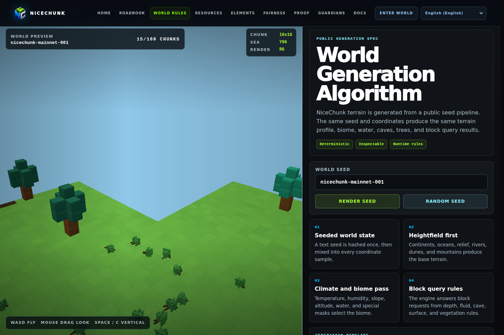

# NiceChunk World Rule

Visual reference for NiceChunk world generation rules.

## Project Overview

This repository contains the world rule reference page. It turns the deterministic world generation library into an explorable explanation of chunk structure, terrain behavior, seed behavior, and visual world concepts.

The page is documentation with live rendering. It helps contributors understand how low-level terrain rules become actual player-facing world surfaces.

It intentionally depends on world generation modules rather than duplicating algorithm logic in prose.

## System Principles

- Explain with live data: rule pages should render actual generated results whenever possible.
- Keep rules traceable: each visible concept should map back to generation modules and configuration constants.
- Separate algorithm from presentation: the reusable generator belongs in worldgen, while this repository focuses on explanation and visualization.
- Use stable English copy for developer-facing rule descriptions.

## How It Works

- Run the page through Vite and inspect the world rule views in English.
- Use the page to verify that changes in terrain generation still produce explainable behavior.
- Update rule copy and screenshots when generation parameters or block categories change.
- Keep imports aligned with the worldgen repository boundaries.

## Why This Project Matters

Procedural systems are hard to trust when they are only described in source code. This page gives designers and developers a shared visual reference.

As NiceChunk opens more systems to contributors, this repository becomes the bridge between algorithm design and product communication.

## Repository Layout

- `world_rule/`
- `src/world/`
- `src/render/`

## Development Workflow

1. Clone the repository and inspect the focused source tree before changing shared contracts or generated artifacts.
2. Keep changes scoped to the domain of this repository. Cross-domain changes should be coordinated through the matching split repositories.
3. Run the smallest meaningful validation for the touched surface: build checks for programs, browser checks for pages, or fixture checks for deterministic libraries.
4. Update screenshots and documentation when behavior, visible UI, public constants, or developer-facing workflows change.

## Future Development Direction

- Add coordinate input tools for inspecting specific generated locations.
- Render deterministic side-by-side comparisons between world config versions.
- Add fixture-based screenshots for release notes.
- Link rule sections to resource and proof-of-frontier pages.

## Maintenance Notes

This repository is a focused split from the main NiceChunk working tree. Keep the public surface explicit: avoid committing private keys, wallet files, deployment-only scripts, machine-specific configuration, or generated build artifacts. Runtime user-facing copy should stay behind the i18n layer where the project has an i18n surface.
